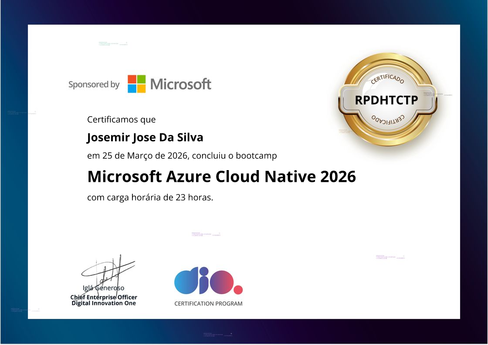

<!--
  Nota: a imagem do certificado fica em ./images/.
  Se você substituir a imagem, atualize o caminho no src abaixo.
-->

  

  

    <strong>Certificado</strong>:
    <a href="https://www.dio.me/certificate/RPDHTCTP/share">ver credencial na DIO</a>
  

# 🌳 Cloud Native Azure Journey

Repositório do bootcamp da DIO focado em **arquitetura cloud-native no Azure**, com abordagem **hands-on**: desenho e integração entre serviços gerenciados, boas práticas de **segurança** (identidade, RBAC, Key Vault), automação e **documentação técnica** (diagramas, evidências e guias).

## 📦 Labs Desenvolvidos

- ✅ **Lab01** – Azure SQL Database e Blob Storage  
  Criação de infraestrutura básica com banco relacional e armazenamento de objetos. Pasta: [`lab01-azure-sql-blob-storage`](./lab01-azure-sql-blob-storage).

- ✅ **Lab02** – Container Apps Blog  
  Containerização da aplicação e uso do Azure Container Registry. Pasta: [`lab02-azure-container-apps-blog`](./lab02-azure-container-apps-blog).

- ✅ **Lab03** – API Management (Secure Payments API)  
  Governança de APIs no Azure API Management: políticas, segurança e observabilidade. Pasta: [`lab03-azure-api-management-secure-payments`](./lab03-azure-api-management-secure-payments).

- ✅ **Lab04** – Serverless autenticador de boletos  
  Azure Functions (Consumption, Windows) e Azure Service Bus; documentação e evidências de provisionamento. Pasta: [`lab04-azure-serverless-boleto-authenticator`](./lab04-azure-serverless-boleto-authenticator).

- ✅ **Lab05** – GitHub Copilot no VS Code  
  Instalação, configuração e aprendizados com GitHub Copilot no Visual Studio Code. Pasta: [`lab05-github-copilot-vscode`](./lab05-github-copilot-vscode).

- ✅ **Lab06** – Arquitetura cloud-native (aluguel de carros)  
  Arquitetura de referência com **diagramas Mermaid** e documentação de **segurança**: integração de **Azure Functions** com **Azure Key Vault** via **Managed Identity**, **RBAC** e **referências nativas** em *Application Settings*, além de observabilidade. (Sem código/IaC neste lab; foco em documentação e evidências.) Pasta: [`lab06-cloud-native-car-rental-architecture`](./lab06-cloud-native-car-rental-architecture).

## 🎯 Objetivo
Construir uma base sólida em Cloud Native alinhada às práticas modernas do Azure,
DevOps e soluções escaláveis.

