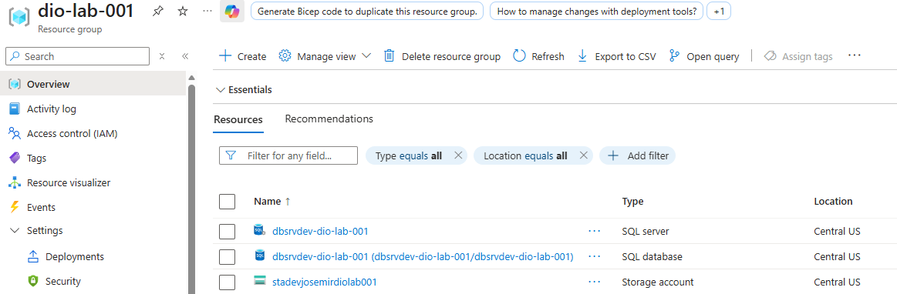
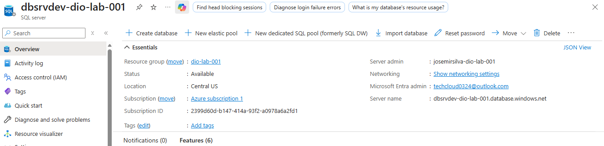
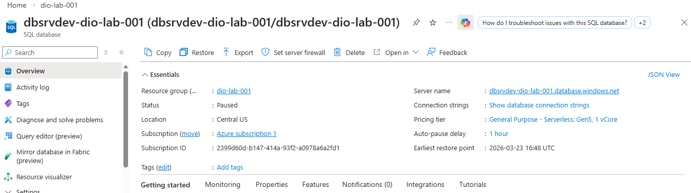
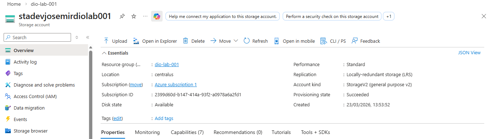

Lab 01 – Azure SQL Database e Blob Storage
Este laboratório marca o início da minha jornada prática em Cloud Native no Microsoft Azure, com foco na criação de infraestrutura básica utilizando serviços gerenciados de banco de dados e armazenamento.

🎯 Objetivo do Lab
Provisionar e configurar recursos fundamentais no Azure para suportar aplicações modernas, utilizando:

Banco de dados relacional gerenciado

Armazenamento de objetos escalável

Boas práticas de organização e nomenclatura

Conceitos iniciais de arquitetura Cloud Native

🏗️ Arquitetura Criada
A arquitetura deste laboratório é composta por:

## 🖼️ Recursos Criados no Azure
Um Azure SQL Server hospedando um Azure SQL Database

Um Azure Storage Account com suporte a Blob Storage

Recursos provisionados na mesma região para reduzir latência

Estrutura preparada para futura integração com aplicações e APIs

Essa base representa um cenário comum em aplicações corporativas modernas, onde dados estruturados e não estruturados coexistem.

☁️ Serviços Azure Utilizados
Azure SQL Server

Azure SQL Database

Azure Storage Account

Azure Blob Storage

Resource Group

Azure Portal

🖼️ Prints do Portal
Os prints abaixo documentam os recursos criados durante o laboratório:

Lista de recursos no Resource Group

Azure SQL Server e Database provisionados

Storage Account configurado

Região e status dos serviços

## 🖼️ Recursos Criados no Azure

📌 Os prints estão disponíveis na pasta docs/images.

🧠 Insights Técnicos (Aprendizados)
Durante a execução deste laboratório, alguns pontos importantes ficaram claros:

Serviços PaaS reduzem significativamente a complexidade operacional

A escolha da região impacta diretamente latência e custos

Azure SQL Database abstrai tarefas como patching e backups

Blob Storage é ideal para dados não estruturados e escaláveis

Uma boa nomenclatura de recursos facilita gestão e manutenção

Mesmo arquiteturas simples já seguem princípios Cloud Native

🚀 Possíveis Evoluções
Este laboratório serve como base para evoluções naturais, como:

🔗 API Cloud Native  
Integração do Azure SQL Database com uma API REST (Lab 02)

🐳 Containers  
Containerização da aplicação utilizando Docker e Azure Container Registry

☸️ AKS (Azure Kubernetes Service)  
Orquestração da aplicação em Kubernetes para alta disponibilidade e escalabilidade

🔐 DevSecOps  
Automação de infraestrutura, pipelines CI/CD e práticas de segurança

📊 Observabilidade  
Monitoramento, logs e métricas com Azure Monitor e Application Insights

📌 Conclusão
Este laboratório estabelece a fundação da jornada Cloud Native, criando uma infraestrutura sólida, escalável e alinhada às práticas modernas do Azure.
A partir dessa base, é possível evoluir para arquiteturas mais complexas, integrando aplicações, automação e observabilidade.