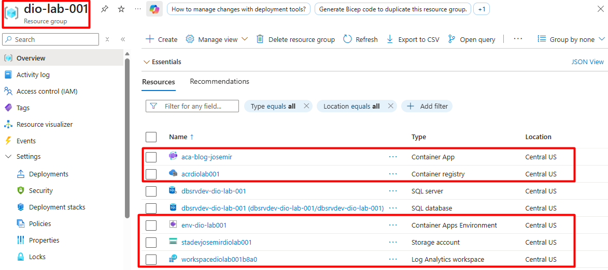
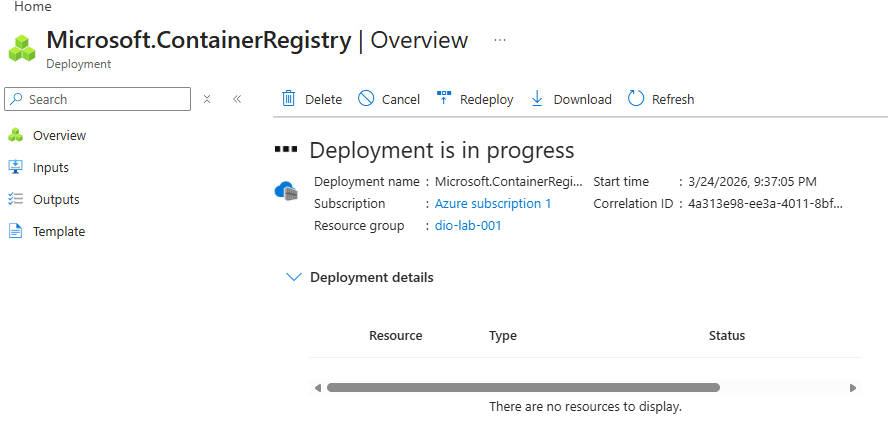
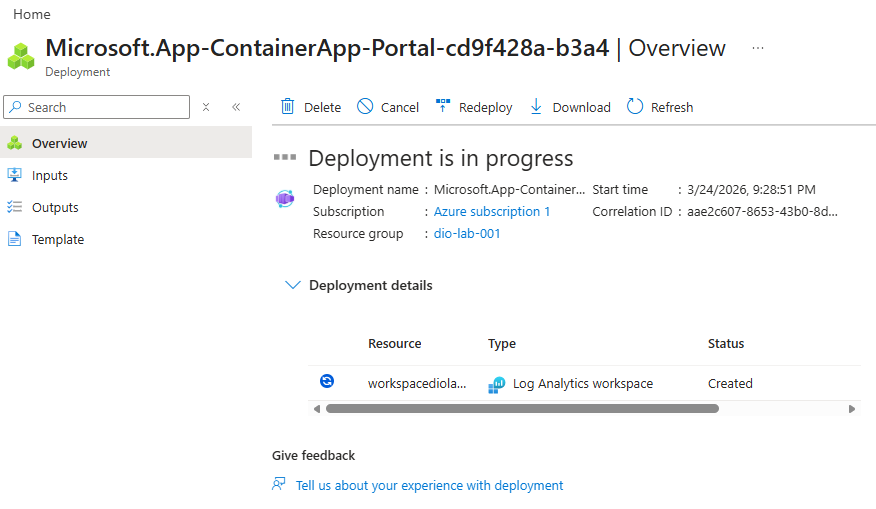
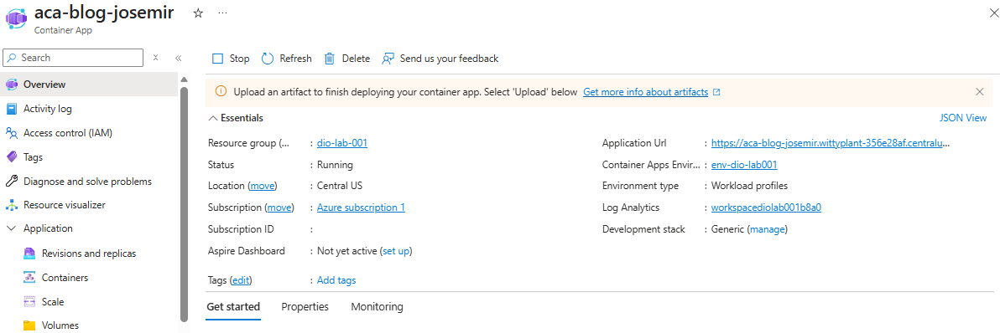
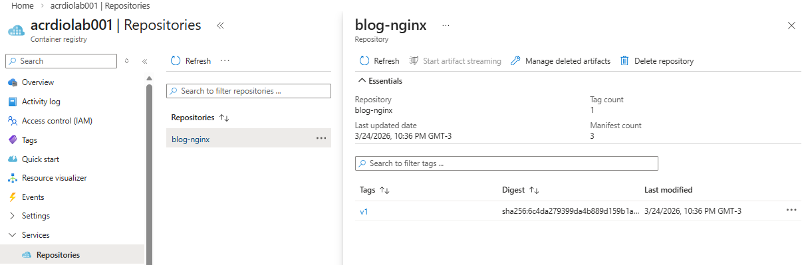
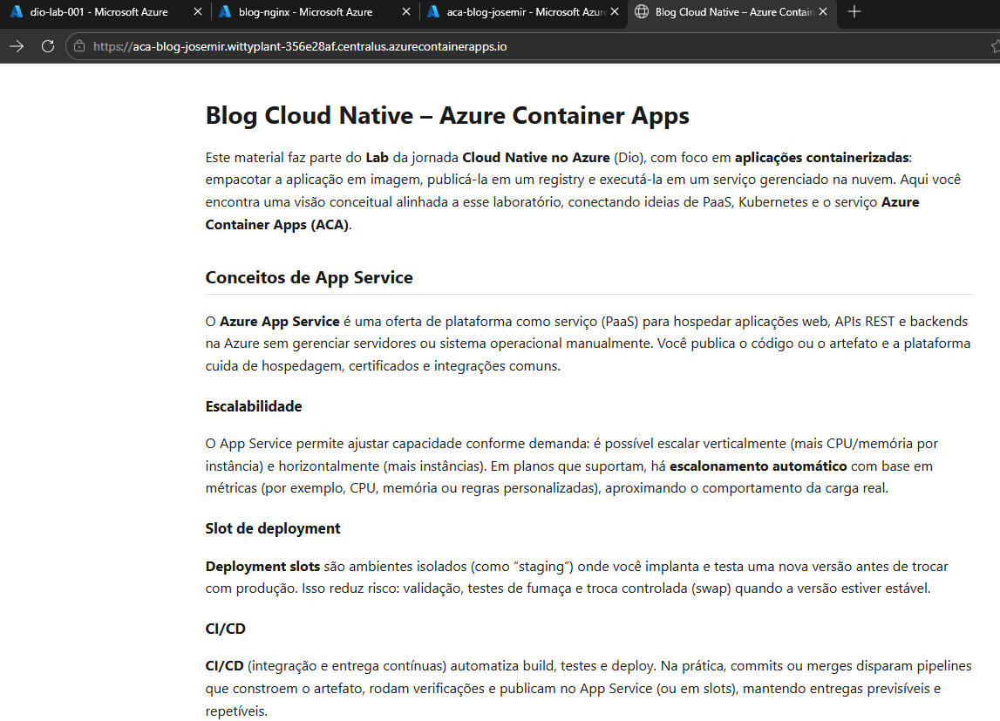

# Lab – Azure Container Apps: Blog Cloud Native

## Introdução

Este laboratório integra a jornada **Cloud Native no Azure**. O objetivo é publicar um **blog estático** empacotado em **imagem de contêiner** (Nginx servindo HTML) e executá-lo em **Azure Container Apps (ACA)**.

O foco é o modelo **PaaS moderno para contêineres**: menos encargo operacional do que operar orquestração completa manualmente, com **escalabilidade automática** e integração nativa com ambientes compartilhados e observabilidade centralizada.

## Arquitetura

Fluxo lógico de acesso e componentes:

```
  Usuário
     |
     v
  Internet
     |
     v
  Azure Container Apps (ingress HTTPS)
     |
     v
  Container (Nginx + HTML, porta 80)
     |
     v
  Container Apps Environment (CAE)
     |
     +------------------+------------------+
     v                                     v
Log Analytics workspace              Azure Container Registry (ACR)
(observabilidade)                    (imagem: build, push; pull autorizado pelo app)
```

**Papel de cada componente:**

| Componente | Descrição |
|------------|-----------|
| **Azure Container Apps** | Serviço gerenciado que executa revisões do contêiner, expõe **ingress** (HTTP/HTTPS), escala réplicas e integra com identidade e registros. |
| **Container Apps Environment (CAE)** | Limite compartilhado que agrupa apps na mesma região; define perímetro de rede e integrações comuns (por exemplo, vínculo com Log Analytics e opções de rede). |
| **Log Analytics** | Workspace que reúne **logs e consultas** para diagnóstico, correlação e alertas das cargas executadas no ambiente. |
| **Azure Container Registry (ACR)** | Registry privado para armazenar a **imagem** do blog; o Container App realiza **pull** autorizado (por exemplo, identidade gerenciada com papel **AcrPull**). |

Repositório de aplicação neste lab: `Dockerfile` baseado em `nginx:alpine` e conteúdo estático em `app/`.

## Comandos Executados via Azure CLI

Os trechos abaixo são **exemplos coerentes** com o fluxo de um Container App que consome imagem do ACR. Ajuste nomes de assinatura, localização (`location`) e nomes de recursos aos do seu ambiente.

### Variáveis de ambiente (opcional)

```bash
export LOCATION="centralus"
export RESOURCE_GROUP="dio-lab-001"
export ACR_NAME="acrdiolab001"
export CAE_NAME="env-dio-lab-001"
export CONTAINER_APP="aca-blog-josemir"
export IMAGE_NAME="blog-nginx"
export IMAGE_TAG="v1"
```

### Login e contexto da assinatura

```bash
az login
az account show --output table
# az account set --subscription "<subscription-id-ou-nome>"
```

### Extensão Azure Container Apps

```bash
az extension add --name containerapp --upgrade
```

### Resource Group

```bash
az group create \
  --name "$RESOURCE_GROUP" \
  --location "$LOCATION"
```

### Azure Container Registry

```bash
az acr create \
  --resource-group "$RESOURCE_GROUP" \
  --name "$ACR_NAME" \
  --sku Basic \
  --location "$LOCATION"

az acr login --name "$ACR_NAME"
```

### Build e publicação da imagem

Build na nuvem com ACR Tasks (quando permitido pela assinatura e políticas):

```bash
cd /caminho/para/lab-azure-container-apps-blog

az acr build \
  --registry "$ACR_NAME" \
  --resource-group "$RESOURCE_GROUP" \
  --image "${IMAGE_NAME}:${IMAGE_TAG}" \
  --file Dockerfile \
  .
```

Em assinaturas onde **ACR Tasks** não esteja disponível, utilize build local e envio:

```bash
docker build -t "${ACR_NAME}.azurecr.io/${IMAGE_NAME}:${IMAGE_TAG}" .
docker push "${ACR_NAME}.azurecr.io/${IMAGE_NAME}:${IMAGE_TAG}"
```

### Container Apps Environment

```bash
az containerapp env create \
  --name "$CAE_NAME" \
  --resource-group "$RESOURCE_GROUP" \
  --location "$LOCATION"
```

> Em cenários com workspace existente, o ambiente pode ser criado já associando o Log Analytics correspondente; consulte a documentação atual para os parâmetros `--logs-workspace-id` quando necessário.

### Identidade e permissão no ACR

```bash
az containerapp identity assign \
  --name "$CONTAINER_APP" \
  --resource-group "$RESOURCE_GROUP" \
  --system-assigned

ACR_ID=$(az acr show --name "$ACR_NAME" --resource-group "$RESOURCE_GROUP" --query id -o tsv)
PRINCIPAL_ID=$(az containerapp show --name "$CONTAINER_APP" --resource-group "$RESOURCE_GROUP" --query identity.principalId -o tsv)

az role assignment create \
  --assignee-object-id "$PRINCIPAL_ID" \
  --assignee-principal-type ServicePrincipal \
  --role "AcrPull" \
  --scope "$ACR_ID"

az containerapp registry set \
  --name "$CONTAINER_APP" \
  --resource-group "$RESOURCE_GROUP" \
  --server "${ACR_NAME}.azurecr.io" \
  --identity system
```

### Criação ou atualização do Azure Container App

Criação (exemplo minimalista; adapte CPU/memória e ingress ao seu padrão):

```bash
az containerapp create \
  --name "$CONTAINER_APP" \
  --resource-group "$RESOURCE_GROUP" \
  --environment "$CAE_NAME" \
  --image "${ACR_NAME}.azurecr.io/${IMAGE_NAME}:${IMAGE_TAG}" \
  --target-port 80 \
  --ingress external \
  --registry-server "${ACR_NAME}.azurecr.io" \
  --registry-identity system
```

Atualização da imagem em app já existente:

```bash
az containerapp update \
  --name "$CONTAINER_APP" \
  --resource-group "$RESOURCE_GROUP" \
  --image "${ACR_NAME}.azurecr.io/${IMAGE_NAME}:${IMAGE_TAG}"
```

Ingress externo (se precisar habilitar ou corrigir):

```bash
az containerapp ingress enable \
  --name "$CONTAINER_APP" \
  --resource-group "$RESOURCE_GROUP" \
  --type external \
  --target-port 80 \
  --transport auto
```

FQDN da aplicação:

```bash
az containerapp show \
  --name "$CONTAINER_APP" \
  --resource-group "$RESOURCE_GROUP" \
  --query "properties.configuration.ingress.fqdn" \
  -o tsv
```

## Evidências

As capturas abaixo ficam em **`docs/images/`** (caminho relativo a este lab) e são referenciadas no README para exibição no GitHub, Azure DevOps ou qualquer visualizador Markdown compatível.

| # | Arquivo | Descrição |
|---|---------|-----------|
| 1 | `resources-lab-azure-container-app-blob.png` | Visão de recursos do laboratório no portal (resource group e serviços relacionados). |
| 2 | `acr-creating.png` | Registro de contêiner (ACR) no portal. |
| 3 | `aca-creating.png` | Criação/configuração do Azure Container Apps no portal. |
| 4 | `aca-blog-josemir.png` | Container App **aca-blog-josemir** (overview ou detalhe operacional). |
| 5 | `acr-repository-app-blog-nginx.png` | Repositório de imagens no ACR com o artefato do blog. |
| 6 | `blog-publicado.png` | Blog acessível via URL pública (ingress externo). |

**Pré-visualização:**













**Versionamento no Git:** os arquivos em `docs/images/` são binários (PNG); não há regra em `.gitignore` na raiz do repositório que os exclua. Antes de `git push`, abra cada PNG e confirme que **não aparecem** (entre outros):

- **Subscription ID** (GUID da assinatura no portal ou em URLs do tipo `/subscriptions/...`)
- **Tenant ID**, IDs de objeto de identidade ou segredos copiados de blades
- Barras de endereço ou painéis com tokens ou strings de autenticação

Se algum dado sensível estiver visível, substitua a imagem por uma versão editada (recorte, borrão) ou recapture a tela após ocultar colunas sensíveis no portal.

## Aprendizados

- **App Service, ACA e AKS** atendem perfis diferentes: PaaS tradicional para apps web/API, PaaS orientado a contêiner com abstração forte, e Kubernetes gerenciado com controle e complexidade operacional maiores.
- **PaaS para contêineres** reduz tempo com plataforma e favorece ciclos de entrega quando o time não precisa customizar cada camada do cluster.
- O **CAE** concentra isolamento lógico, rede compartilhada no perímetro do ambiente e **observabilidade** integrada ao Log Analytics.
- O **Azure CLI** viabiliza repetibilidade, automação e documentação do que foi aplicado na infraestrutura.

## Próximos passos

- **CI/CD** com GitHub Actions (build, scan de imagem, push ao ACR e deploy no ACA).
- **Domínio customizado** e certificados no ingress do Container App.
- **Observabilidade avançada**: dashboards, alertas e correlação com Application Insights quando fizer sentido para a carga.
- **Evolução para AKS** quando surgir necessidade de APIs Kubernetes completas, operadores ou requisitos de rede e política muito específicos.

---

*Nota de transparência: parte do conteúdo deste README foi elaborada com apoio de ferramentas de IA e revisada por Josemir Silva, no contexto do bootcamp Dio — jornada Cloud Native no Azure.*
