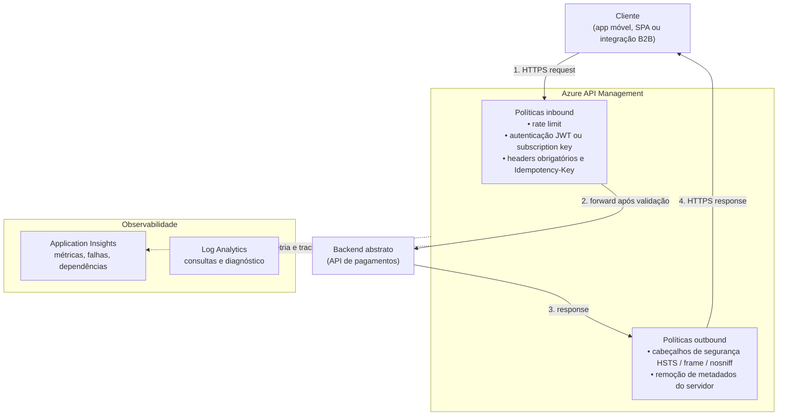
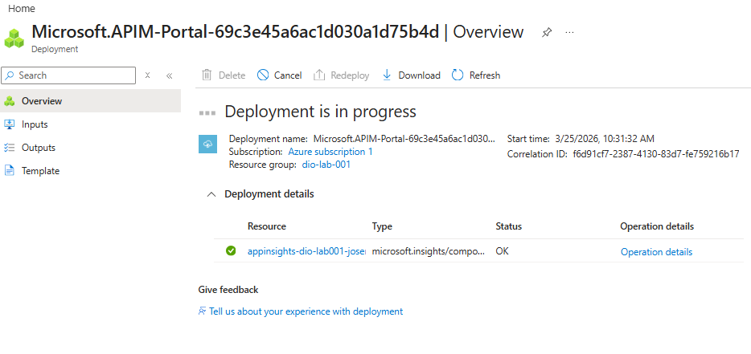
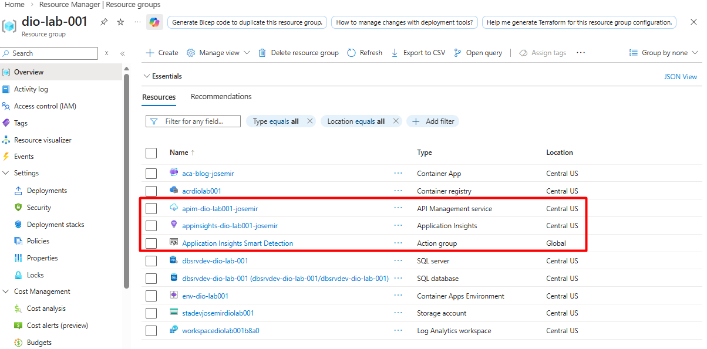

# Lab – Azure API Management: Secure Payments API

Este laboratório integra a jornada **Cloud Native no Azure** e trata da exposição segura de uma **API de pagamentos** por meio do **Azure API Management (APIM)**.

## Objetivo do lab

- Centralizar o acesso à API no gateway (políticas, limites, segurança).
- Preparar contratos e configurações versionáveis no repositório, sem acoplar ao portal como única fonte da verdade.
- Documentar decisões e evidências para revisão acadêmica ou profissional.

> **Estado atual (entrega):** o **Azure API Management** foi **provisionado** no Azure; as políticas em `policies/` estão **definidas e documentadas no repositório** como exemplos para **futura aplicação** no serviço (ainda **não coladas nem implantadas** no portal neste marco). Há **diagramas Mermaid** em `diagrams/` e **evidências** em `docs/images/` referentes ao provisionamento de recursos. Não há backend nem simulação de execução de API; o foco é arquitetura, governança e portfólio.

## Arquitetura

O diagrama abaixo resume o fluxo **requisição → gateway (políticas) → backend abstrato → resposta**, com **Application Insights** e **Log Analytics** para observabilidade.

Versão versionada (dois quadros: componentes e sequência): **[`diagrams/secure-payments-architecture.md`](./diagrams/secure-payments-architecture.md)**.

## Segurança e políticas

A camada de **governança** concentra-se no APIM. Os arquivos em **`policies/`** descrevem **políticas preparadas para aplicação** no APIM (exemplos XML versionados); elas **não substituem** a configuração efetiva no portal até serem importadas ou coladas no escopo desejado. O conjunto cobre boas práticas para uma API de pagamentos:

| Política (arquivo) | Papel |
|----------------------|--------|
| **`rate-limit.xml`** | Proteção contra abuso e picos com **rate limiting** por chave (ex.: IP); reduz risco de fraude automatizada e sobrecarga. |
| **`validate-subscription-key.xml`** | Modelo **subscription key**: exige `Ocp-Apim-Subscription-Key`; em POST de pagamento, reforça **Idempotency-Key** e **Content-Type** JSON. |
| **`validate-jwt.xml`** | Modelo **OAuth2/OIDC**: validação de **JWT** Bearer (Entra ID / OIDC) antes de encaminhar ao backend. |
| **`set-security-headers.xml`** | **Outbound**: HSTS, anti-MIME sniff, `X-Frame-Options`, `Referrer-Policy`, remoção de cabeçalhos que expõem stack. |
| **`custom-error-response.xml`** | **Respostas de erro** JSON padronizadas (ex.: 401, 429), com correlação para suporte, sem vazar detalhes internos. |

Orientações sobre **quando** cada política poderá ser aplicada (API, operação ou produto) estão em [`policies/README.md`](./policies/README.md). Em cenários reais, **JWT** e **subscription key** raramente se misturam no mesmo escopo sem roteamento explícito; o lab deixa ambos documentados para comparar modelos.

## Evidências

Capturas atuais em **`docs/images/`** (revisar dados sensíveis antes de publicar o repositório):

| Imagem | Descrição |
|--------|-----------|
|  | Recorte do portal durante criação ou configuração do **Azure API Management**. |
|  | Recursos **provisionados** no resource group (**APIM** e **Application Insights** ou monitoramento associado), sem comprovar chamadas de API nem políticas já ativas. |

Lista e convenções de nomes: [`docs/images/README.md`](./docs/images/README.md).

## Aprendizados – governança de APIs

- **Gateway como ponto único de política:** autenticação, limites e transformações no APIM reduzem repetição no backend e aceleram auditoria.
- **Contrato antes da implementação:** manter **OpenAPI** em `api/` alinha consumidores, portal de desenvolvedores e importação no APIM (quando o escopo incluir o arquivo).
- **Erros e idempotência em pagamentos:** respostas **401/429/400** previsíveis e **Idempotency-Key** são essenciais para integrações financeiras seguras e rastreáveis.
- **Observabilidade integrada:** **Application Insights** e **Log Analytics** permitem correlacionar falhas de política, latência e dependência ao backend abstrato.
- **Versionar políticas em Git:** o XML em `policies/` suporta revisão por pares e pipelines, em linha com **DevOps** e **compliance**.

## Estrutura do repositório

| Pasta | Descrição |
|-------|-----------|
| **`api/`** | Contrato da API em **OpenAPI (Swagger)**: operações, esquemas e exemplos alinhados ao que o APIM publicará. Não contém implementação de backend. |
| **`policies/`** | Políticas do APIM em **XML** (limites, segurança, autenticação e transformações). |
| **`diagrams/`** | Diagramas **Mermaid** e documentação visual; ver [`secure-payments-architecture.md`](./diagrams/secure-payments-architecture.md). |
| **`docs/images/`** | Evidências do **provisionamento** no Azure Portal (capturas revisadas). |

## Próximos passos (escopo)

Aplicar no APIM as políticas versionadas, publicar APIs/produtos, integrar backend real de pagamentos e validar com testes e **Trace** no portal — quando o projeto avançar além deste marco de documentação.

---

*Conteúdo elaborado com apoio de ferramentas de IA e sujeito à revisão no contexto do bootcamp Dio — Cloud Native no Azure.*
