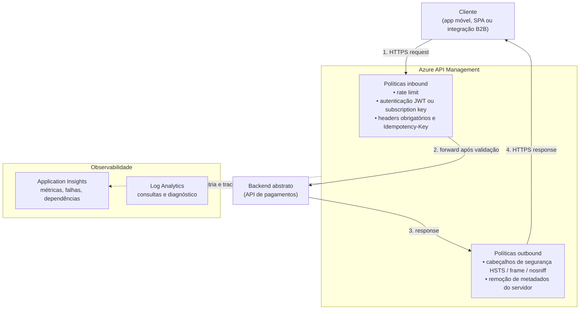
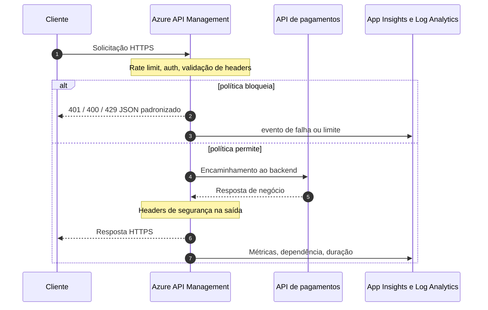

# Arquitetura – Azure API Management (Secure Payments API)

Visão lógica do laboratório: cliente consome uma **API de pagamentos** exposta apenas através do **Azure API Management**, com políticas de governança no gateway e **observabilidade** associada.

## Visão em camadas (componentes)

## Fluxo de requisição e resposta (tempo)

---

*Diagramas em Mermaid; renderize no GitHub ou em extensões compatíveis com VS Code / Cursor.*
