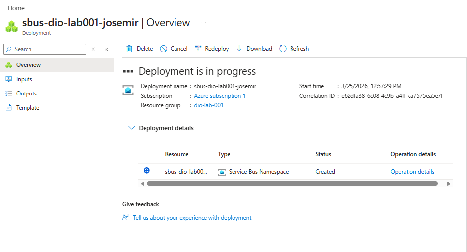
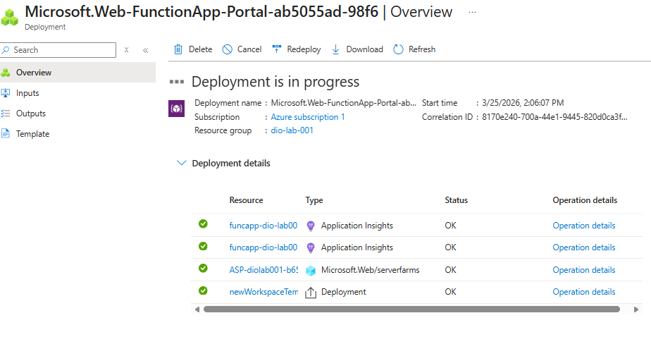
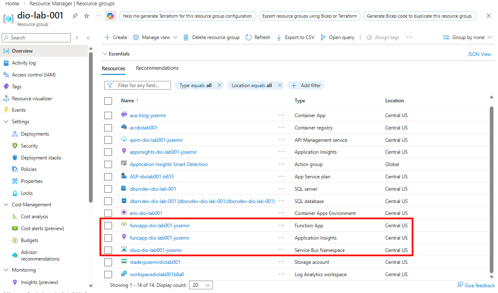
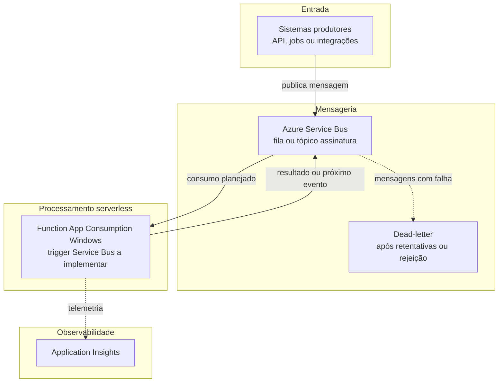

# Azure Serverless – Autenticador de Boletos

Laboratório focado em um **serviço serverless** para **autenticação de boletos** na Azure, integrando **Azure Functions** e **Azure Service Bus** em um fluxo assíncrono e escalável.

## Objetivo do lab

- Definir uma base **versionável** (código, mensageria e documentação) para validação ou enriquecimento de dados de boleto sem manter servidores dedicados 24/7.
- Explorar o padrão **event-driven**: produtores publicam mensagens; **Functions** consomem e orquestram o processamento.
- Documentar decisões de arquitetura e evidências do portal para entrega acadêmica ou portfólio.

## Escopo

- **Autenticação de boletos** (no sentido de **verificar autenticidade / consistência** ou integrar com regras de negócio e sistemas legados — o detalhamento funcional evoluirá nas próximas iterações).
- Entrada típica: mensagens que representam solicitações ou eventos relacionados a boletos; saída: resultados publicados de volta na mensageria ou persistidos em serviços ainda não definidos neste marco.

## Serviços Azure envolvidos

| Serviço | Papel neste lab |
|---------|------------------|
| **Azure Service Bus** | Barramento de mensagens para desacoplar produtores e consumidores. **Namespace provisionado no portal.** **Sem** integração configurada com a Function App e **sem** processamento de negócio por este repositório neste marco. |
| **Azure Functions** | **Function App** criada no plano **Consumption** com sistema operacional **Windows**; **Application Insights** associado (quando habilitado na criação). **Nenhuma Function** foi implementada nem publicada; não há integração ativa com o Service Bus neste estágio. |
| **Application Insights** | Telemetria da Function App (e futuramente dependências). Habilitado junto à criação da app. |
| **Storage Account** | Exigido pela plataforma de Functions (metadados e integração interna). Criado automaticamente no fluxo do portal ou informado na CLI. |

Outros serviços (Key Vault, APIM, etc.) podem entrar quando o escopo avançar.

## Estado atual do lab

O ambiente Azure reflete **apenas provisionamento** de infraestrutura base. **Não** há pipeline de autenticação de boletos em execução, **não** há mensagens processadas por este lab no sentido de negócio e **não** há integração configurada entre Function App e Service Bus.

| Marco | Situação |
|-------|----------|
| **Repositório** | Pastas `src/`, `messaging/`, `diagrams/`, `docs/images/` para documentação e evolução incremental. |
| **Azure Service Bus** | **Provisionado** no portal (namespace na região definida no laboratório). |
| **Azure Function App** | **Criada**: plano **Consumption**, host **Windows**; armazenamento associado conforme criação no portal. |
| **Functions** | **Nenhuma** função customizada implementada ou implantada; lista de funções na app permanece vazia neste estágio. |
| **Integração** | **Não configurada** entre Function App e Service Bus (sem triggers, sem *connection strings* da fila na app, sem testes de ponta a ponta documentados aqui). |
| **IaC e código** | Sem Bicep/Terraform neste repositório; **sem** código em `src/`; sem simulação de execução descrita como concluída. |

## Evidências

Capturas em **`docs/images/`** referentes ao **provisionamento** (Service Bus, Function App, visão de recursos no resource group). **Não** comprovam integração entre serviços nem execução de código.

| # | Arquivo | Descrição |
|---|---------|-----------|
| 1 | `Service-Bus-Creating.png` | Criação ou visão do **Azure Service Bus** no portal. |
| 2 | `funcapp-creating.png` | Criação ou detalhes da **Function App** (Consumption, Windows). |
| 3 | `resources-funcapp-servicebus.png` | Recursos do **resource group** alinhados ao lab (Function App, Service Bus, etc.). |







Detalhes e checklist de privacidade: [`docs/images/README.md`](./docs/images/README.md).

## Arquitetura e fluxo (alvo)

O desenho abaixo é o **fluxo pretendido** após implementação das Functions e integração com o Service Bus. Hoje, apenas a **infraestrutura base** existe no Azure; as setas de negócio representam a **evolução planejada**, não um estado já operacional.

Versão completa com **diagrama de sequência**: [`diagrams/boleto-authenticator-architecture.md`](./diagrams/boleto-authenticator-architecture.md).



## Referência: provisionar Function App (Consumption + Windows + Application Insights)

Use esta seção como **referência** para reproduzir o lab ou alinhar novos ambientes. Os recursos deste projeto **já foram criados** conforme o estado acima.

### Região

Use a **mesma região** do **namespace do Service Bus** (ex.: `Brazil South`, `East US`): reduz latência, simplifica narrativa de arquitetura e evita surpresas de disponibilidade de SKUs. Confira a região em **Service Bus** → *Properties* no portal.

### Opção A — Azure Portal

1. **Criar recurso** → pesquisar **Function App** → **Criar**.
2. **Assinatura e Resource group:** o mesmo grupo do Service Bus (recomendado no lab) ou outro, conforme sua organização.
3. **Nome da Function App:** globalmente único (ex.: `func-boleto-auth-<sufixo>`).
4. **Publicar:** *Código* (functions tradicionais; ainda sem publicar código neste passo).
5. **Pilha de runtime:** escolha uma stack **placeholder** (ex.: **.NET** ou **Node**) — pode ser alterada depois quando o projeto for criado; o importante agora é o plano e o Insights.
6. **Região:** igual à do Service Bus.
7. **Sistema operacional:** neste lab, **Windows** (alinhado à Function App já provisionada).
8. **Plano:** **Consumption (Serverless)** — é o modelo serverless padrão alinhado ao “free tier” de execuções (uso dentro da faixa gratuita = sem cobrança de compute nas regras atuais da Microsoft).
9. **Armazenamento:** crie uma **nova** Storage Account ou use uma existente na mesma região.
10. **Application Insights:** **Ativar**; deixe criar um recurso novo ou associe um existente na mesma região.
11. Revisar + **Criar**.

Após a implantação: no portal, abra a Function App e confirme **Functions** vazio (ou só templates), **sem** funções personalizadas publicadas.

### Opção B — Azure CLI (referência)

Ajuste nomes, região e runtime conforme seu ambiente. Exemplo esqueleto com **Windows** (alinhado ao lab atual):

```bash
RESOURCE_GROUP="rg-seu-grupo"
LOCATION="brazilsouth"
STORAGE_NAME="stboletoauthxxxx"
FUNCTION_APP="func-boleto-auth-xxxx"
APP_INSIGHTS="appi-boleto-auth-xxxx"

az storage account create \
  --name "$STORAGE_NAME" \
  --resource-group "$RESOURCE_GROUP" \
  --location "$LOCATION" \
  --sku Standard_LRS

az monitor app-insights component create \
  --app "$APP_INSIGHTS" \
  --location "$LOCATION" \
  --resource-group "$RESOURCE_GROUP" \
  --application-type web

az functionapp create \
  --name "$FUNCTION_APP" \
  --resource-group "$RESOURCE_GROUP" \
  --storage-account "$STORAGE_NAME" \
  --consumption-plan-location "$LOCATION" \
  --runtime dotnet-isolated \
  --runtime-version 8 \
  --functions-version 4 \
  --os-type Windows \
  --app-insights "$APP_INSIGHTS"
```

*(O par runtime `--runtime` / `--runtime-version` é exemplificativo; confira stacks suportadas em Windows Consumption na documentação atual.)*

Detalhes exatos de parâmetros (`--app-insights`, versões de runtime) variam com a versão da CLI; use `az functionapp create --help` e o [guia Microsoft Learn](https://learn.microsoft.com/azure/azure-functions/functions-create-function-app-portal).

**Neste marco:** não execute `func azure functionapp publish`, não adicione triggers e não configure *connection string* do Service Bus na app.

## Próximos passos

1. Manter `docs/images/` atualizado e **revisado** antes de novos commits (sem dados sensíveis).
2. Refinar `diagrams/` quando filas, nomes de função e contratos de mensagem estiverem definidos.
3. Inicializar projeto em `src/` e implementar trigger **Service Bus** quando o lab avançar.
4. Modelar contratos de mensagem em `messaging/` (schemas ou exemplos).

---

*Documentação elaborada com apoio de ferramentas de IA e sujeita à revisão no contexto do bootcamp Dio — Cloud Native no Azure.*
