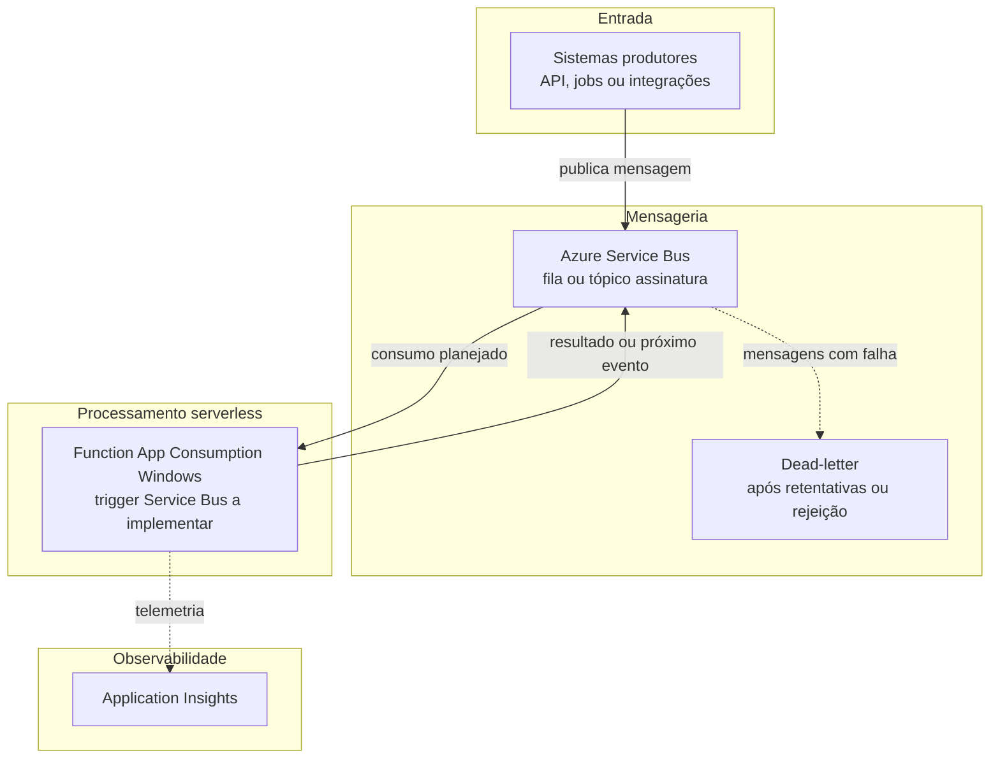
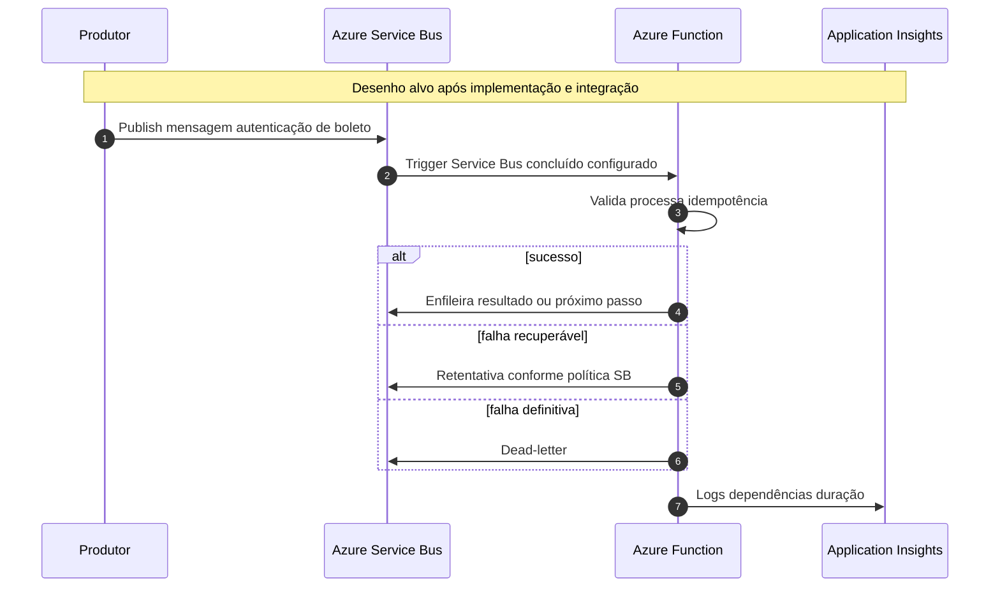

# Arquitetura e fluxo – Autenticador de boletos (serverless)

Este documento descreve o **fluxo lógico-alvo** do laboratório: mensageria **Azure Service Bus** + processamento **Azure Functions** em **Function App Consumption (Windows)** e **Application Insights**.

> **Marco atual do lab (conforme README raiz):** namespace **Service Bus** e **Function App** já estão **provisionados** no Azure; **não** há integração configurada, **não** há funções implementadas e **não** há tráfego de negócio documentado como concluído. O diagrama representa o **desenho pretendido** para as próximas etapas.

## Visão em camadas

## Fluxo no tempo (mensagem)

## Leitura rápida

| Elemento | Função no autenticador |
|-----------|-------------------------|
| **Produtor** | Envia payload validação identificador ou referência de boleto. |
| **Service Bus** | Desacopla picos garante entrega e DLQ. |
| **Function** | Executa regra de autenticação sem VM dedicada. |
| **Application Insights** | Diagnóstico latência e falhas. |

---

*Mermaid compatível com o renderizador do GitHub; ajuste rótulos quando filas e nomes de função estiverem fechados.*
