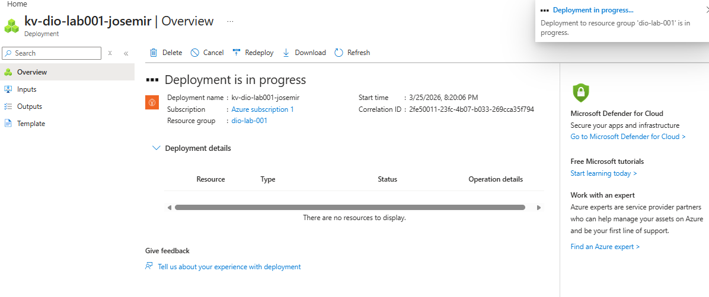
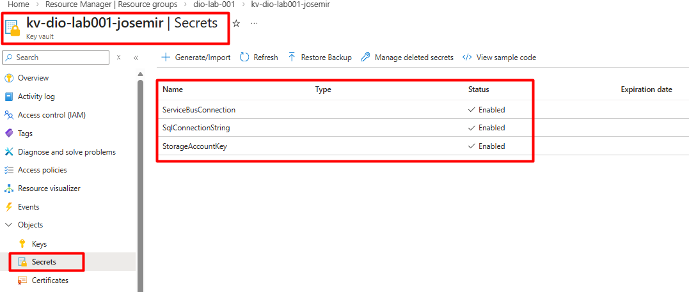
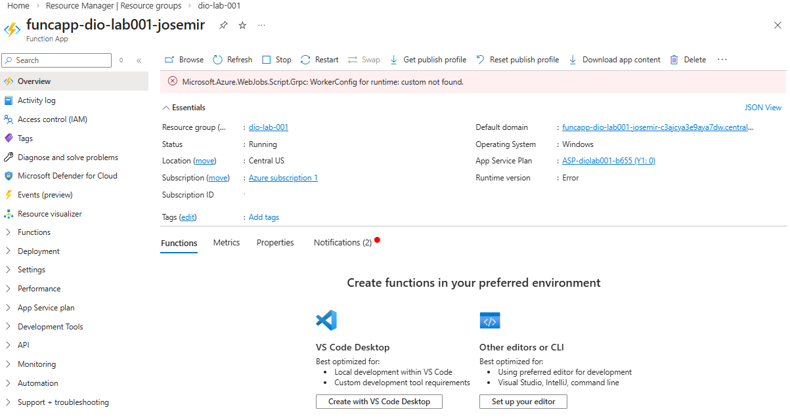

# Lab06 – Arquitetura cloud-native: aluguel de carros

## Objetivo do lab

Consolidar a **arquitetura cloud-native** de referência para **aluguel de carros** na Microsoft Azure e documentar, de forma **profissional**, o **aperfeiçoamento de segurança** deste marco: integração da **Azure Function App** ao **Azure Key Vault** com **identidade gerenciada**, **RBAC** e **referências nativas** em **Application Settings** — alinhado à jornada **DIO / Cloud Native** e adequado a **portfólio**.

**Escopo da documentação:** diagramas em Mermaid, README e evidências em `images/`. **Não** há código de aplicação nem infraestrutura como código versionada neste laboratório; a **configuração Azure** (cofre, identidade, papéis e *app settings*) foi realizada via **Azure CLI** conforme roteiro do bootcamp.

## Visão geral da arquitetura

A solução separa **experiência do usuário** (front-end), **API síncrona** atrás de **API Management** e **BFF**, **processamento assíncrono** (**Azure Service Bus** + **Azure Functions**), **persistência relacional ou multimodelo**, **notificações** e capacidades **transversais**: **segurança de segredos** (**Key Vault** + **Managed Identity**) e **observabilidade** (**Application Insights** / **Log Analytics**).

O desenho favorece **escalabilidade elástica**, **baixo acoplamento** via mensageria, **menor superfície de credenciais** estáticas e **rastreabilidade** operacional.

### Diagramas

| Documento | Propósito |
|-----------|-----------|
| **[`diagrams/logical-architecture-macro.md`](./diagrams/logical-architecture-macro.md)** | **Macro:** componentes lógicos (cliente, front-end, APIM, BFF, Service Bus, Function App, banco, Key Vault, observabilidade). |
| **[`diagrams/runtime-flow-e2e.md`](./diagrams/runtime-flow-e2e.md)** | **Runtime fim a fim:** sequência de requisição, enfileiramento, processamento, acesso ao Key Vault com MI, persistência e notificação. |
| **[`diagrams/car-rental-architecture.md`](./diagrams/car-rental-architecture.md)** | **Visão consolidada legada:** fluxograma e sequência simplificada de reserva + texto explicativo (mantido para continuidade com entregas anteriores). |

## Componentes principais

| Camada | Papel | Serviço Azure (referência típica) |
|--------|--------|-----------------------------------|
| **Front-end** | Interface web ou móvel; catálogo, reserva, acompanhamento. | *Static Web Apps*, *App Service*, *SPA* com *CDN* / *Front Door*. |
| **API Management + BFF** | Gateway com políticas; BFF agrega contratos e orquestra chamadas curtas ao domínio. | *Azure API Management* + *Container Apps*, *App Service* ou funções HTTP, conforme padrão adotado. |
| **Azure Function App** | Workers **event-driven**: confirmações, integrações, processamento após mensagens. | *Azure Functions* acionadas por filas ou eventos; **Application Settings** com referências ao Key Vault. |
| **Mensageria** | Desacopla picos e falhas; retries e DLQ em cenários críticos. | *Azure Service Bus*. |
| **Banco de dados** | Dados transacionais: frota, reservas, clientes. | *Azure SQL Database*, *PostgreSQL Flexible* ou *Cosmos DB*, conforme modelo. |
| **Notificações** | E-mail, SMS, push ou webhooks. | *Azure Communication Services*, *Event Grid* + integrações. |
| **Key Vault** | Segredos e configurações sensíveis (ex.: cadeias de conexão, chaves). | *Azure Key Vault* com modelo **RBAC** no cofre. |
| **Observabilidade** | Métricas, logs, traços, dashboards. | *Application Insights* + *Log Analytics*. |

## Segurança e identidade

### Managed Identity

A **Function App** utiliza **identidade gerenciada atribuída pelo sistema** para autenticar na plataforma Azure **sem** armazenar credenciais de aplicativo em código ou em repositório. Essa identidade é o **principal** ao qual se concedem permissões sobre recursos (neste lab, o **Key Vault**).

### Azure Key Vault

O **cofre** centraliza segredos de aplicação utilizados pelo processamento assíncrono, por exemplo:

- `SqlConnectionString`
- `ServiceBusConnection`
- `StorageAccountKey`

Os valores reais residem **apenas** no Key Vault (versões recuperáveis conforme política do cofre), não nas definições de ambiente em texto claro no controle de origem.

### RBAC (controle de acesso baseado em função)

No modelo **RBAC do Key Vault** (autorização `enableRbacAuthorization`), a Function App recebe a função **Key Vault Secrets User** no **escopo do cofre** (ou escopo mais restrito, se a política da organização exigir), permitindo **obter** o material do segredo em runtime sem permissões de gestão do cofre.

### Referências nativas do Key Vault em Application Settings

As variáveis de ambiente da Function App são configuradas com o padrão:

`@Microsoft.KeyVault(SecretUri=https://<nome-do-cofre>.vault.azure.net/secrets/<nome-do-segredo>/)`

A **plataforma** resolve a referência em **tempo de execução** usando a **Managed Identity**. O **Azure CLI** pode ocultar o valor na resposta imediata de `config appsettings set`; a validação correta é feita com `az functionapp config appsettings list`, exibindo a **string de referência** (não o segredo).

**Observações operacionais:** não é obrigatório **reiniciar manualmente** o Function App após alterar *app settings* como regra geral; a **primeira** resolução após mudanças de RBAC ou segredo pode sofrer **atraso de alguns minutos**.

## Evidências (`images/`)

Capturas de tela que **comprovam** a configuração Azure deste marco estão em **[`images/`](./images/)**, com os **nomes padronizados** abaixo. Revise privacidade antes do *commit* (subscription ID, tenant, dados pessoais — ver [`images/README.md`](./images/README.md)).

> **Importante:** três evidências (`lab06-keyvault-overview`, `lab06-keyvault-secrets`, `lab06-functionapp-managed-identity`) estão preenchidas com capturas do laboratório. Substitua **`lab06-keyvault-rbac-role-assignment.png`** e **`lab06-functionapp-appsettings-keyvault-ref.png`** (ainda **placeholders** mínimos) por prints da folha **Access control (IAM)** do cofre e de **Configuration → Application settings** da Function App, **sem mudar os nomes dos arquivos**. Detalhes em [`images/README.md`](./images/README.md).

### Convenção de nomes e conteúdo

| Arquivo | O que a evidência deve demonstrar |
|---------|----------------------------------|
| `lab06-keyvault-overview.png` | Visão do **Key Vault** (nome, resource group, RBAC habilitado). |
| `lab06-keyvault-secrets.png` | Lista de **segredos** (`SqlConnectionString`, `ServiceBusConnection`, `StorageAccountKey`) **sem** exibir valores. |
| `lab06-functionapp-managed-identity.png` | **System-assigned identity** ativa na Function App (**Object ID** visível para correlacionar com RBAC). |
| `lab06-keyvault-rbac-role-assignment.png` | Atribuição **Key Vault Secrets User** no escopo do cofre para o principal da Function App. |
| `lab06-functionapp-appsettings-keyvault-ref.png` | **Application Settings** com `@Microsoft.KeyVault(SecretUri=...)` (referências, não segredos em claro). |

### Galeria (referências no README)

*Key Vault: visão geral (resource group, cofre com autorização RBAC).*

*Segredos criados: nomes visíveis; valores mascarados ou não expostos.*

*Identidade gerenciada atribuída pelo sistema (`Object ID` para correlação com IAM do cofre).*

*Atribuição de função no escopo do cofre para o principal da Function App. **Placeholder** até incluir print da folha IAM do cofre.*

*Variáveis de ambiente com `@Microsoft.KeyVault(SecretUri=...)`. **Placeholder** até incluir print de Application settings.*

## Insights e aprendizados

- **BFF + APIM** reduzem acoplamento do cliente a backends internos e facilitam evolução de contratos e políticas.
- **Mensageria** isola falhas e picos entre camada síncrona e **workers** serverless.
- **Key Vault + Managed Identity + RBAC** eliminam padrões frágeis de segredo em repositório e reduzem risco de vazamento por configuração.
- **Referências nativas** em *app settings* permitem que o **código** continue lendo variáveis de ambiente usuais, sem alteração de implementação só para integrar o cofre.
- **Observabilidade** desde o desenho acelera diagnóstico de falhas em API, filas e funções.

---

## Transparência e limites deste marco

- Este repositório documenta **arquitetura**, **fluxos** e a **integração Key Vault ↔ Function App** realizada no Azure; **não** inclui código-fonte da aplicação de aluguel nem simulação de execução ponta a ponta como critério de conclusão.
- **Load tests**, **SLOs** e **IaC** completo podem compor fases futuras fora do escopo mínimo do Lab06.
- Nomes de recursos reais (assinatura, cofre, *function app*) podem variar por aluno; ao publicar o portfólio, **anonimize** o que for sensível.

---

*Documentação elaborada para revisão no contexto do bootcamp DIO — Cloud Native no Azure e para uso em portfólio profissional.*
