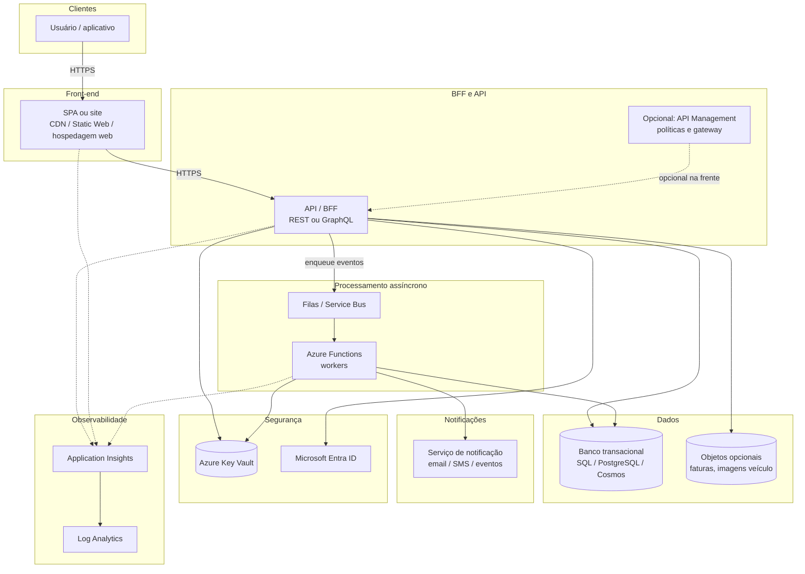
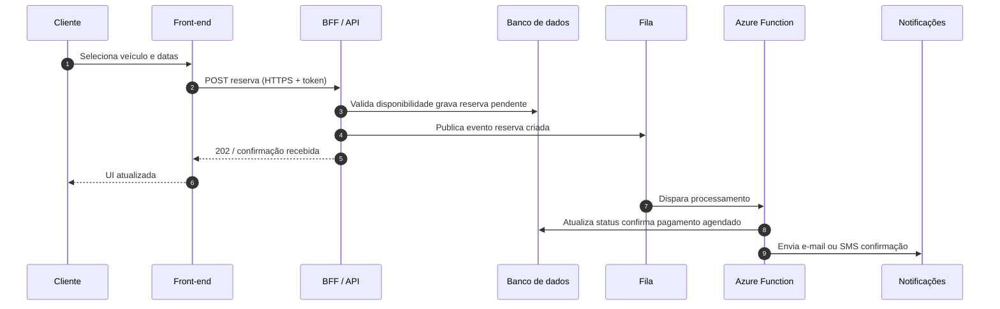

# Arquitetura alvo – Aluguel de carros (cloud-native)

> **Nota:** este documento descreve uma **arquitetura alvo** de referência na Azure. **Não** representa um sistema implantado nem medido neste laboratório; serve para **fluxo**, **ensino** e **portfólio**.

**Atualização Lab06:** para visão **macro** com **API Management** explícito e sequência **runtime** incluindo **Key Vault** e **Managed Identity**, ver também [`logical-architecture-macro.md`](./logical-architecture-macro.md) e [`runtime-flow-e2e.md`](./runtime-flow-e2e.md).

## Diagrama de componentes e fluxo HTTPS

Visão de alto nível: cliente, borda web, BFF, mensageria, workers, dados, notificações, segredos e observabilidade.

## Diagrama de sequência (reserva simplificada)

Exemplo ilustrativo: fluxo **síncrono** na API + **assíncrono** para confirmação e notificação.

## Explicação do fluxo

1. **Front-end** entrega a experiência e **não** implementa regras críticas de negócio sozinho; autenticação costuma delegar ao **Entra ID** (ou fluxo OAuth configurado no BFF).
2. **BFF / API** é o limiar **HTTPS** para o domínio de aluguel: validação, orquestração leve e transações curtas com o **banco**.
3. Trabalho **demorado ou integrador** (gerar recibo, acionar parceiro, anti-fraude) sai do caminho síncrono e vai para **filas**, consumidas por **Azure Functions**.
4. **Notificações** reagem a eventos processados, sem bloquear a resposta HTTP ao usuário.
5. **Key Vault** centraliza segredos; **identidades gerenciadas** reduzem credenciais estáticas entre serviços Azure.
6. **Application Insights** e **Log Analytics** permitem rastrear latência da API, falhas em functions e dependências (banco, fila, notificações).

Este desenho pode ser refinado (por exemplo *Event Grid* entre camadas, *read models*, *CQRS*) em evoluções posteriores — fora do escopo mínimo deste lab.
