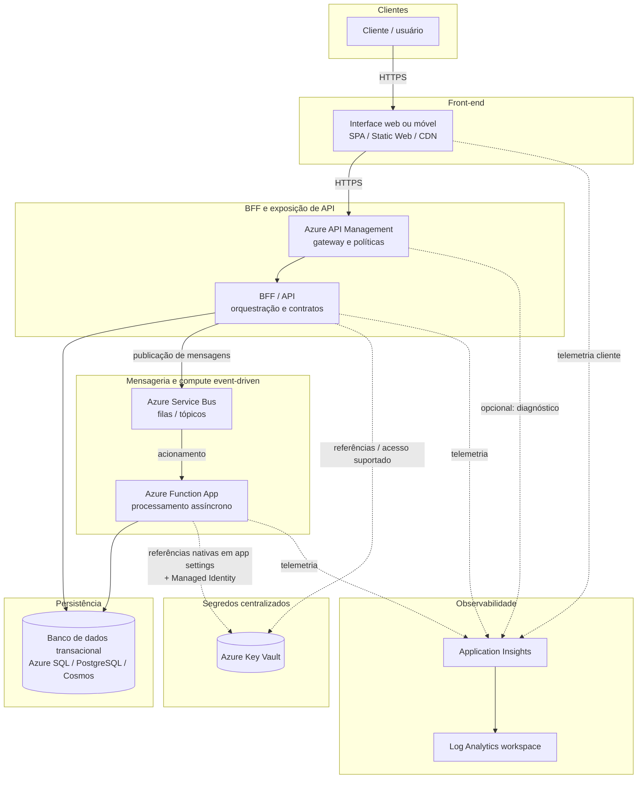

# Diagrama macro — arquitetura lógica (cloud-native)

Visão de **alto nível** dos componentes principais da solução de **aluguel de carros** na Azure: experiência do cliente, gateway e BFF, processamento assíncrono, dados, segredos e observabilidade.

> **Uso:** documentação, portfólio e alinhamento com a jornada **DIO — Cloud Native**. Não descreve dimensões de implantação (regiões, SKUs nem IaC).

## Leitura rápida

- **Front-end** isola a experiência; o tráfego de API costuma passar por **API Management** antes do **BFF**.
- **Service Bus** desacopla picos e falhas entre a API síncrona e os **workers** na **Function App**.
- **Key Vault** concentra segredos; a **Function App** consome valores via **referências nativas** e **identidade gerenciada**, sem credenciais no código.
- **Application Insights** e **Log Analytics** dão visibilidade ponta a ponta.

Para o **fluxo em tempo de execução** (incluindo resolução de segredo no runtime), ver [`runtime-flow-e2e.md`](./runtime-flow-e2e.md).
