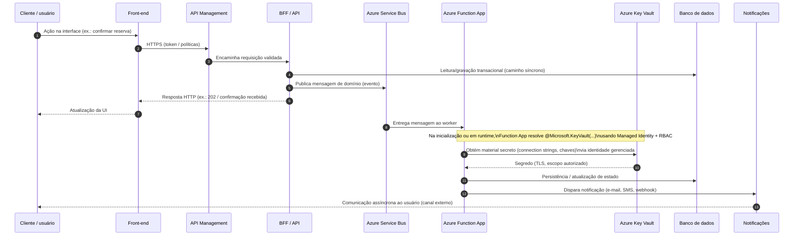

# Diagrama — fluxo fim a fim (runtime)

Sequência **ilustrativa** de uma operação (ex.: **criação de reserva** ou evento de domínio equivalente): caminho síncrono até o BFF, enfileiramento, processamento na **Function App**, **leitura de configuração/segredos** via **Key Vault** com **Managed Identity**, persistência e notificação.

> **Nota:** o passo **Key Vault** representa a **resolução em runtime** de referências `@Microsoft.KeyVault(SecretUri=...)` nas **Application Settings** (ou acesso via SDK/credencial gerenciada, conforme o projeto). O segredo **não** trafega pela definição da variável no portal/CLI — apenas o **URI** do segredo referenciado.

## Pontos de segurança no fluxo

1. **Borda:** **APIM** concentra autenticação de consumidores, limites e políticas antes do BFF.
2. **Segredos:** o runtime da **Function App** acessa o **Key Vault** como **Service Principal** da identidade gerenciada (**Key Vault Secrets User** no escopo do cofre ou mais restritivo, conforme política).
3. **Superfície de configuração:** **Application Settings** armazenam a **referência**, não o valor do segredo em texto claro.

Para a **visão estática de componentes**, ver [`logical-architecture-macro.md`](./logical-architecture-macro.md).
